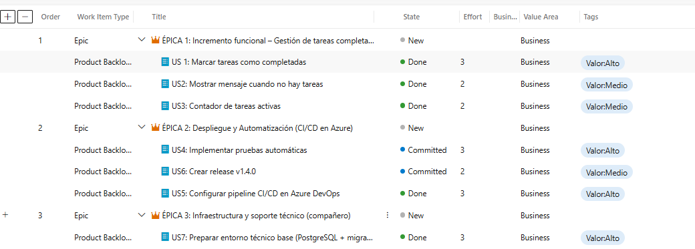
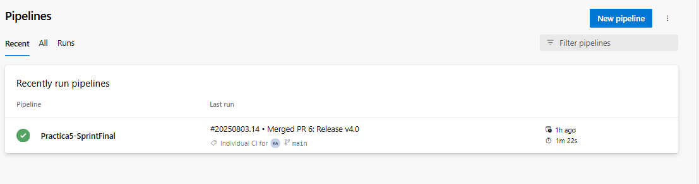
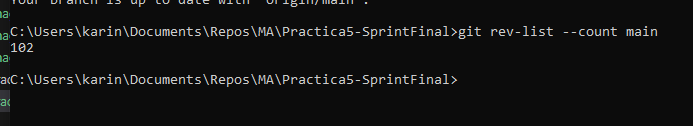
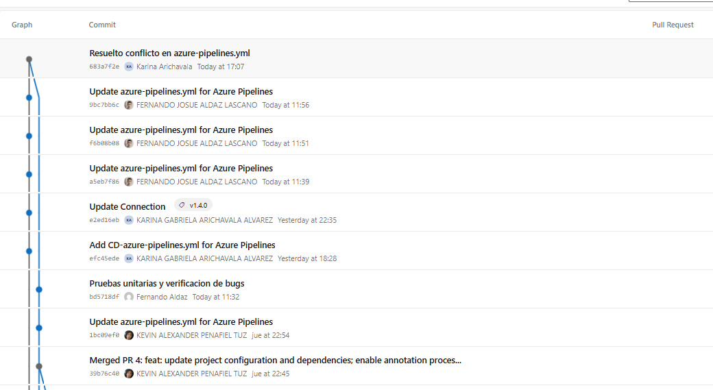
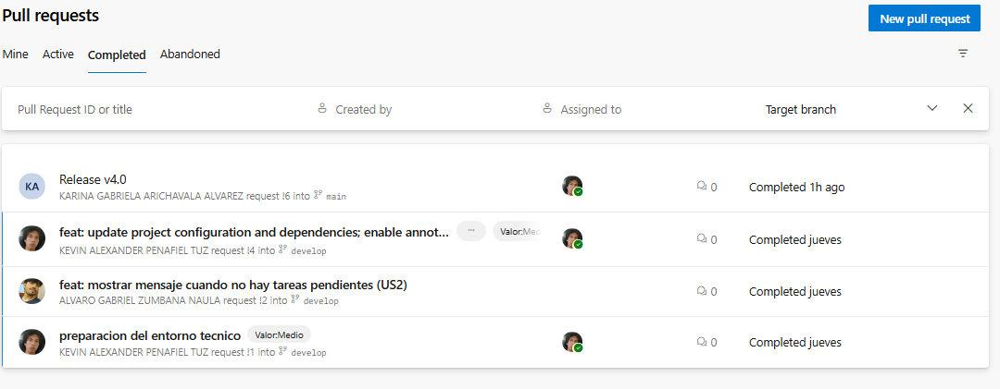
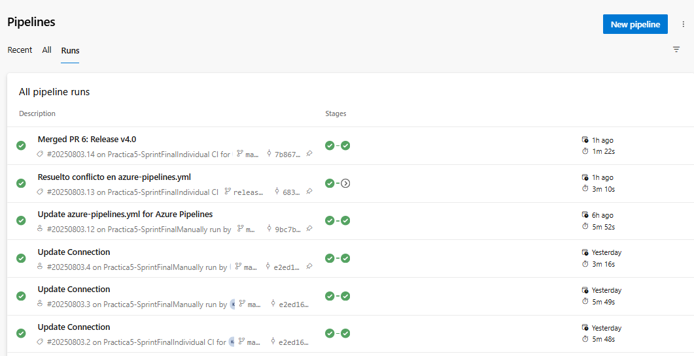
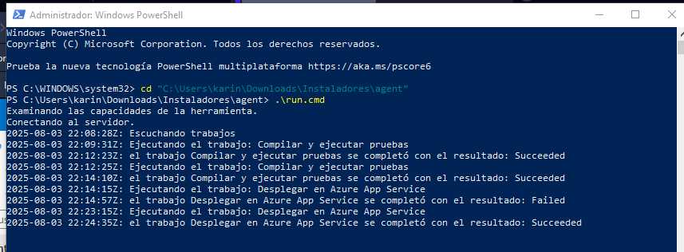
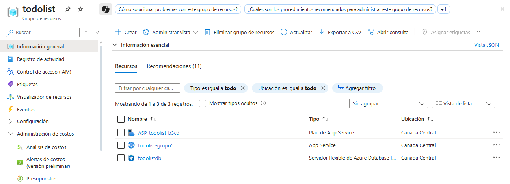
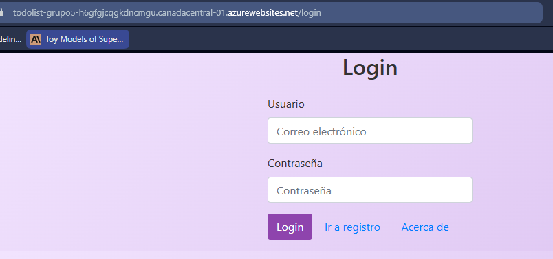
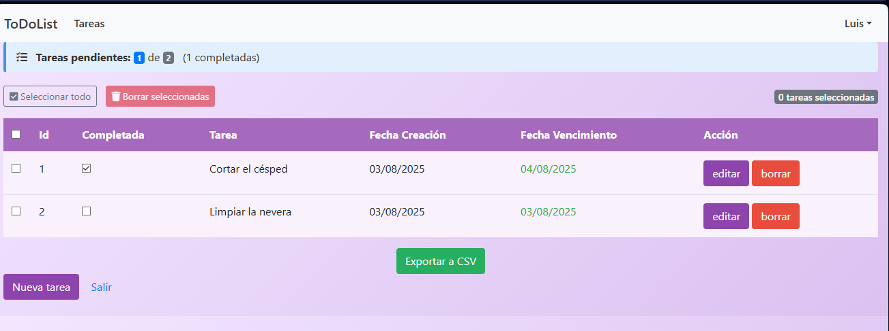

# 📘 Práctica 5 – Sprint Final Azure DevOps

## 🎯 Objetivo
Realizar un incremento funcional de la aplicación **TodoList** utilizando **Azure DevOps** para la gestión completa del ciclo de vida:
- Azure Boards (Backlog, Sprints y Work Items)
- Azure Repos (gestión de código y PRs)
- Azure Pipelines (CI/CD)
- Azure App Service + PostgreSQL (Despliegue en la nube)

---

## 👥 Integrantes
- Álvaro Zumbana  
- Fernando Aldaz  
- Karina Arichavala  
- Kevin Penafiel  
- Maximiliano Madrid  
- Nick Valverde  

---

## 📌 Planificación del Sprint

### Épicas e Historias de Usuario
| Épica | Historia de Usuario | Estado | Esfuerzo | Valor |
|-------|---------------------|--------|---------|-------|
| **ÉPICA 1:** Incremento funcional | US1: Marcar tareas como completadas | Done | 3 | Alto |
|  | US2: Mostrar mensaje cuando no hay tareas | Done | 2 | Medio |
|  | US3: Contador de tareas activas | Done | 2 | Medio |
| **ÉPICA 2:** Despliegue y Automatización | US4: Implementar pruebas automáticas | Committed | 3 | Alto |
|  | US5: Configurar pipeline CI/CD en Azure DevOps | Done | 3 | Alto |
|  | US6: Crear release v1.4.0 | Committed | 2 | Medio |
| **ÉPICA 3:** Infraestructura y soporte técnico | US7: Preparar entorno base (PostgreSQL + migración) | Done | 3 | Alto |

📎 **Evidencia del Backlog:**  

---

## ⚙️ CI/CD en Azure DevOps

El proyecto implementa un **pipeline multistage** dividido en **Integración Continua (CI)** y **Despliegue Continuo (CD)**.  

### **1️⃣ Integración Continua (CI)**
- **Trigger:** Se ejecuta con cada *push* a las ramas:
feature/*
develop
release/*
main

- **Agente:** Self-Hosted Agent (`Agent-Karina`)  
- **Pasos principales:**
1. **Compilación y pruebas con Maven**  
   - Ejecuta `mvn clean package`  
   - Publica resultados de **JUnit**  
2. **Publicación de artefacto JAR** como `drop`  

### **2️⃣ Despliegue Continuo (CD)**
- **Condición:** Solo se ejecuta si:
- CI fue exitoso  
- La rama es `main`  
- **Pasos principales:**
1. Descargar artefacto generado en CI  
2. Desplegar en **Azure App Service** (`todolist-grupo5`)  
3. Base de datos: **Azure PostgreSQL Flexible Server**  

📎 **Resumen del Flujo CI/CD:**  
1. *Push* en `feature`, `develop` o `release` → CI compila y prueba  
2. *Merge* a `main` → CI + CD despliega automáticamente la app  

---

## 📊 Métricas del Sprint
- **Commits totales:** 102
- **Pull Requests aprobadas:** 4
- **Duración promedio de pipeline:** 3 min 48 s  

📎 **Evidencia:**  
- Azure Repos (Commits & PRs)  

- Runs de Azure Pipelines  

---

## 📦 Release Final
- **Versión:** v1.4.0  
- **Estado:** ✅ Deploy exitoso en Azure App Service  
- **Release generado en Azure Pipelines**  
- **Archivos SQL de migración:** en `/sql`  

Self-Hosted Agent

---

Recursos del Grupo de Recursos 'todolist' en Azure

---

## 🔄 Retrospectiva
**Lo bueno:**  
- CI/CD funcional y estable  
- App desplegada con PostgreSQL y migraciones  

**A mejorar:**  
- Optimizar tiempos de pipeline  
- Mayor cobertura de pruebas automáticas

---

Este documento corresponde al **informe de documentación y evidencias** de la Práctica 5 – Sprint Final.
